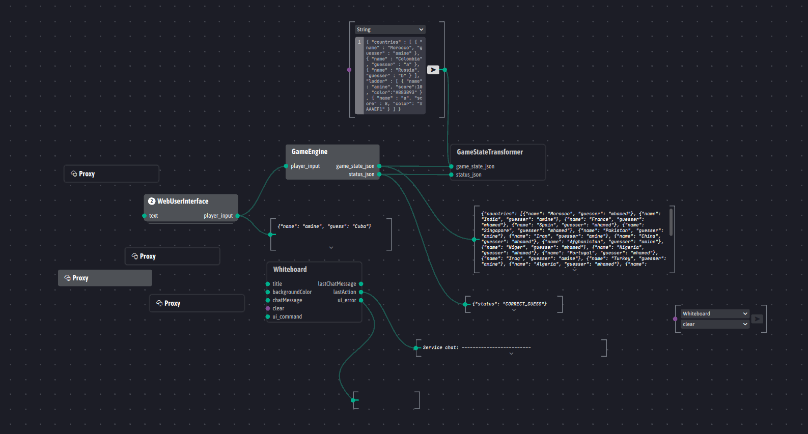
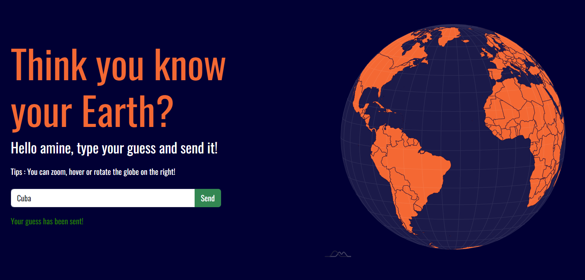

# Country Guesser

## Architecture

L'architecture est basée sur le pattern MVC, chaque agent joue un rôle particulier :

- WebUserInterface : ce controleur gére les interactions du joueur avec le jeu, il permet d'envoyer les inputs du joueur au GameEngine pour être traité.
- GameEngine : ce controleur gére la logique du jeu. C'est lui qui s'occupe d'enregistrer un joueur dans le jeu, vérifier si les inputs sont OK, générer l'état de jeu et le classement des joueurs.
- GameStateTransformer : ce controleur transforme l'état du jeu reçu par le GameEngine en SVG puis en PNG pour l'afficher sur le Whiteboard.

## WebUserInterface

## GameStateTransformer

Documentation and Instructions to install and run are available in [CountryGuesser/GameStateTransformer/README.md](CountryGuesser/GameStateTransformer/README.md).

## About the GameEngine Agent
Documentation and Instructions to install and run are available in [CountryGuesser/GameEngine/README.md](CountryGuesser/GameEngine/README.md).

## Known bugs

Il arrive que le Whiteboard ne clean pas correctement les anciennes images, ou bien charge une image trés ancienne (depuis sa cache si elle existe ?), on ne sait pas si ce bug vient de notre code ou bien de l'implementation du Whiteboard. Pour s'assurer que l'état du jeu généré est correct, il faut aller au dossier ./public/new_world.svg et accéder à l'image ou bien générer un PNG à partir de output.txt (code en base64).

On a pas réussi à faire marcher le projet NodeJS sur Linux, pour tester le projet on a utilisé Hamachi pour créer un réseau LAN virtuel et on a pu tester le jeu ainsi, chaque agent est hebergé dans un PC à distance connecté à deux autres PC par Hamachi.